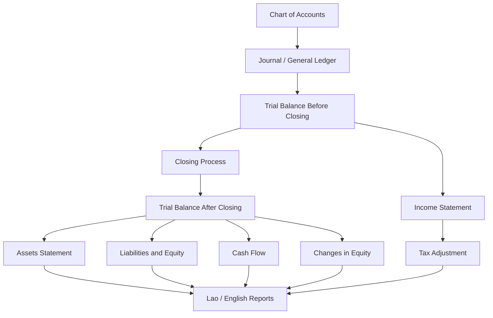

# Lao Accounting Prototype Diagram

```mermaid
flowchart TD
    COA["Chart of Accounts"] --> GL["Journal / General Ledger"]
    GL --> TB1["Trial Balance Before Closing"]
    TB1 --> Close["Closing Process"]
    Close --> TB2["Trial Balance After Closing"]
    TB1 --> Income["Income Statement"]
    Income --> Tax["Tax Adjustment"]
    TB2 --> Assets["Assets Statement"]
    TB2 --> Liabilities["Liabilities and Equity"]
    TB2 --> Cash["Cash Flow"]
    TB2 --> Equity["Changes in Equity"]
    Assets --> Export["Lao / English Reports"]
    Liabilities --> Export
    Tax --> Export
    Cash --> Export
    Equity --> Export
```
